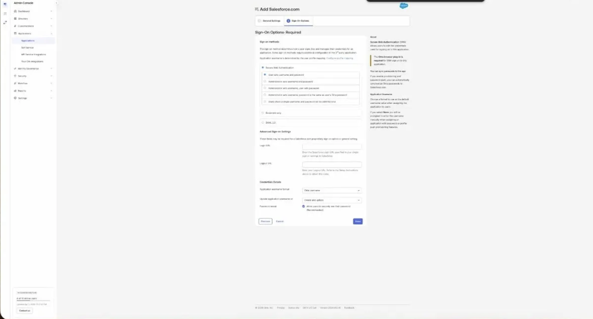
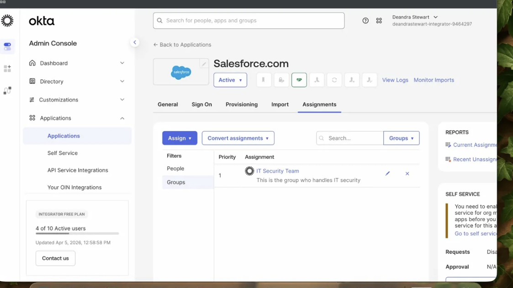

# Lab 01: Application Setup with OIN

## Objective
Add a pre-built app integration from the Okta Integration Network (OIN), configure SAML 2.0 sign-on, and assign a group to the application.

## Environment
- Okta Integrator Free Plan org
- Salesforce Developer Edition
- Admin Console

## Steps

### Add App from OIN
1. Go to **Admin Console → Applications → Applications**
2. Click **Browse App Catalog**
3. Search for **Salesforce.com**
4. Click **Add Integration**

### Configure General Settings
5. Set **Instance Type** to **Production**
6. Enter your **Salesforce Organization ID**
7. Click **Next**

### Configure Sign-On Options
8. Select **SAML 2.0** as the sign-on method
9. Click **Done**

### Assign Group to Application
10. Click the **Assignments** tab
11. Click **Assign → Assign to Groups**
12. Select **IT Security Team**
13. Click **Done**

## Screenshots

## Why This Matters
**IAM Relevance:** OIN integrations enable centralized SSO and provisioning across enterprise applications.

**Okta Platform Use:** SAML 2.0 allows Okta to act as the Identity Provider, controlling access to Salesforce without users needing separate credentials.

**Business Value:** Reduces credential sprawl, improves security posture, and simplifies access management at scale.
