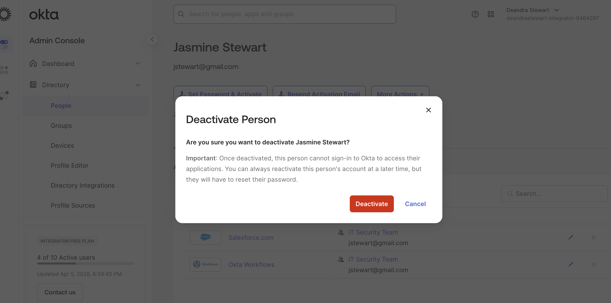
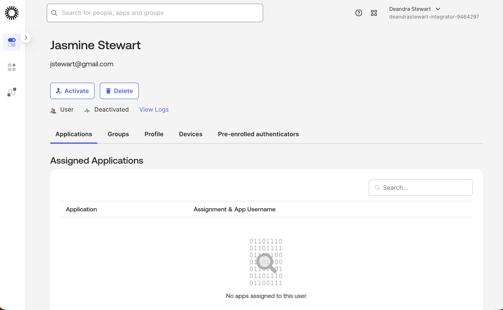

# Lab 01: Attribute Mapping and Offboarding

## Objective
Define attribute mappings to push attributes from Okta to a connected application, deactivate a user, and verify the deactivation.

## Environment
- Okta Integrator Free Plan org
- Salesforce Developer Edition
- Admin Console

---

## Part 1: Define Attribute Mappings

### Steps
1. Go to **Admin Console → Directory → Profile Editor**
2. Click **Salesforce.com** under the Users tab
3. Click **Mappings**
4. Click the **Okta User to Salesforce.com** tab
5. Map the following attributes:

| Okta Attribute | Salesforce Attribute |
|----------------|---------------------|
| user.firstName | firstName |
| user.lastName | lastName |
| user.email | email |
| user.department | department |

6. Click **Save Mappings**
7. Click **Apply updates now**

---

## Part 2: Deactivate a User

### Steps
1. Go to **Admin Console → Directory → People**
2. Select user **Jasmine Stewart**
3. Click **More Actions → Deactivate**
4. Confirm deactivation

### Screenshot

---

## Part 3: Verify User is Deactivated

### Steps
1. Go to **Admin Console → Directory → People**
2. Search for **Jasmine Stewart**
3. Confirm status shows **Deactivated**

### Screenshot

---

## Why This Matters
**IAM Relevance:** Attribute mapping ensures identity data stays consistent across Okta and downstream applications, reducing data drift and access errors.

**Okta Platform Use:** The Profile Editor controls how attributes flow between Okta and connected apps, supporting both provisioning and deprovisioning workflows.

**Business Value:** Supports the Leaver stage of the JML lifecycle by ensuring deactivated users immediately lose access to all connected applications.
