# Lab 01 – Add Users Manually in Okta OIE

## Objective
Practice manually creating a user in Okta Identity Engine (OIE) via the Admin Console.

## Environment
- Okta Integrator Org (OIE)
- Admin Console → Directory → People

## Exam Relevance
- User lifecycle management
- Understanding activation methods and resulting user states

---

## Steps

### 1. Navigate to Directory → People
- In the Admin Console, go to **Directory > People**
- Click **Add Person**

### 2. Fill Out the Add Person Form

| Field | Value Used |
|---|---|
| User Type | User (default) |
| First Name | Dee |
| Last Name | Job |
| Username | deejob101@gmail.com |
| Primary Email | deejob101@gmail.com |
| Secondary Email | *(left blank)* |
| Groups | *(left blank)* |
| Activation | Activate now |
| I will set password | *(unchecked — Okta sends activation email)* |

### 3. Save the User
- Click **Save**
- Okta sends an activation email to the primary email address

---

## Screenshots

**Add Person form filled out:**
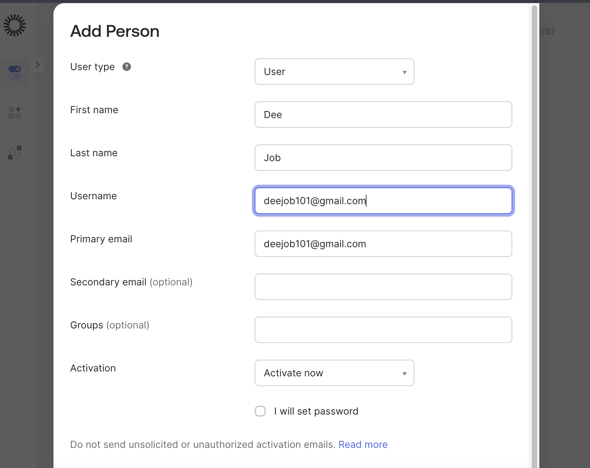

**Activation email received:**
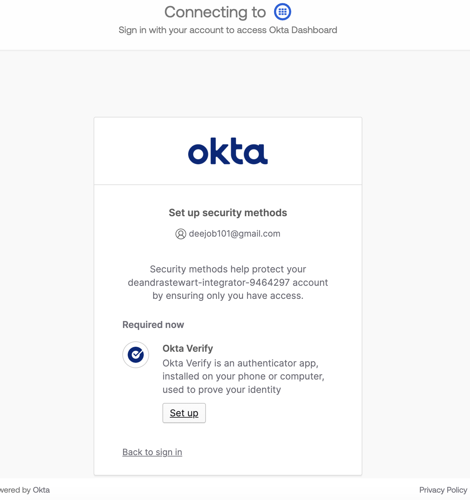

**User status after activation:**
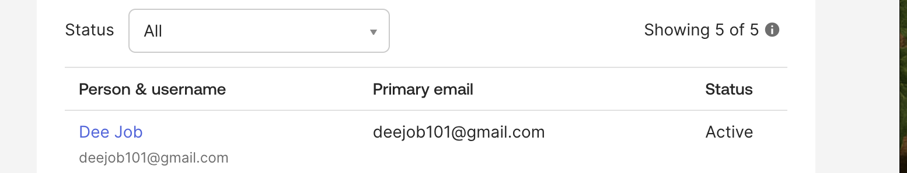

---

## Key Concepts

| Activation Method | Resulting User State |
|---|---|
| Activate now (no password set) | Pending Activation → Active (after email click) |
| Activate now (password set by admin) | Active immediately |
| Activate later | Staged |

## Notes
- Username must be in email format
- "User must change password on first login" appears only when admin sets the password
- Staged users receive no email and cannot log in until activated
- -------
# Lab 02 – Deactivate and Delete User Accounts in Okta OIE

## Objective
Practice deactivating and deleting a user account in Okta Identity Engine (OIE) via the Admin Console.

## Environment
- Okta Integrator Org (OIE)
- Admin Console → Directory → People

## Exam Relevance
- User lifecycle management
- Understanding the difference between suspended, deactivated, and deleted states

---

## Key Concepts

| Action | User Loses App Access | Admin Roles Revoked | Factors Removed | Removed from Groups | Permanent |
|---|---|---|---|---|---|
| Suspended | No | No | No | No | No |
| Deactivated | Yes | Yes | No | No | No |
| Deleted | Yes | Yes | Yes | Yes | Yes |

> Note: A user must be deactivated before they can be deleted. Deletion cannot be undone.

---

## Steps

### Part 1 – Deactivate a User

1. In the Admin Console, go to **Directory > People**
2. Select the user account to deactivate
3. Click **More Actions → Deactivate**
4. Click **Deactivate** in the confirmation dialog
5. User status changes from **Active → Deactivated**

### Part 2 – Delete a User

1. In the Admin Console, go to **Directory > People**
2. Search for the deactivated user
3. Click the username to open their profile
4. Click **Delete**
5. Click **Delete** in the confirmation dialog to permanently remove the account

---

## Screenshots

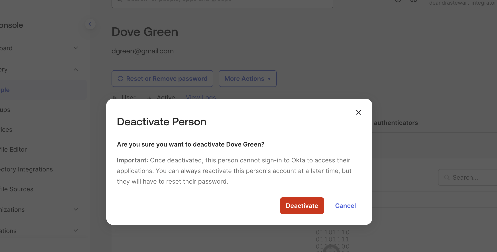
 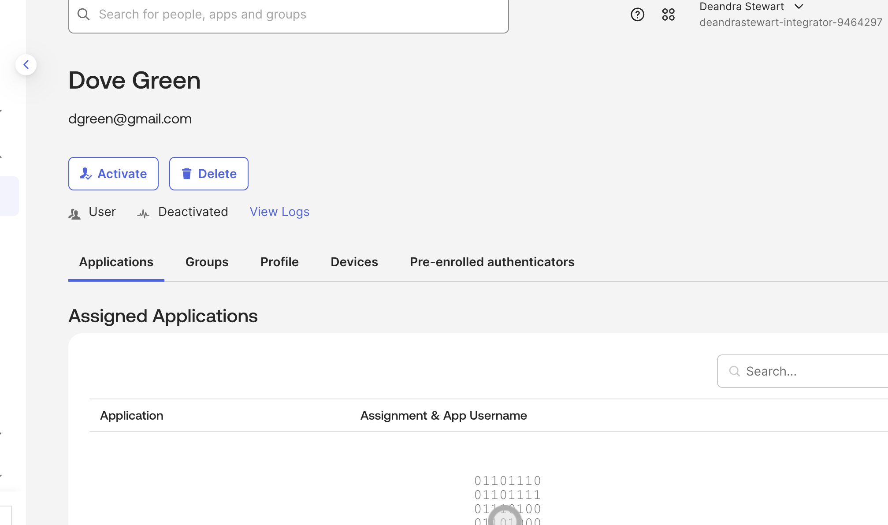
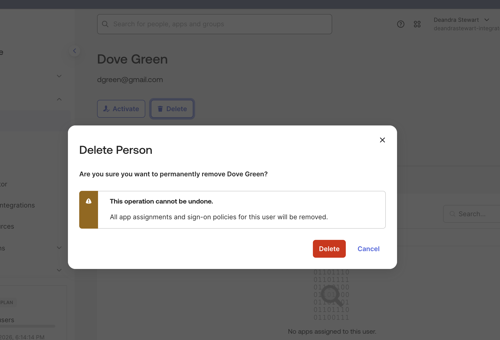

---

## Notes
- Deactivated users are removed from app access but remain in all Okta groups
- Deleted users have their username freed up for reuse
- Okta permanently deletes customer data within 30 days of account deletion
- Admins receive an email listing all users deactivated in the past 30 minutes

--------------
# Lab 03 – Suspend and Unsuspend Users in Okta OIE

## Objective
Practice suspending and unsuspending a user account in Okta Identity Engine (OIE) via the Admin Console.

## Environment
- Okta Integrator Org (OIE)
- Admin Console → Directory → People

## Exam Relevance
- User lifecycle management
- Understanding when to suspend vs deactivate vs delete

---

## Key Concepts

Suspension is a temporary state — useful for:
- Contract or temporary workers
- Employees on leave of absence
- Reviewing a departed user's group and app assignments before deactivating

> Unlike deactivation, a suspended user retains all group memberships and app assignments. Everything is reinstated when the user is unsuspended.

---

## Steps

### Part 1 – Suspend a User

1. In the Admin Console, go to **Directory > People**
2. Search for the user by first name, email, or username
3. Click the username to open their profile
4. Click **More Actions → Suspend**
5. User status changes to **Suspended**

### Part 2 – Unsuspend a User

1. In the Admin Console, go to **Directory > People**
2. In the left menu, click **Suspended** to filter by suspended users
3. Click the username to open their profile
4. Click **Activate**
5. User status returns to **Active**

---

## Screenshots
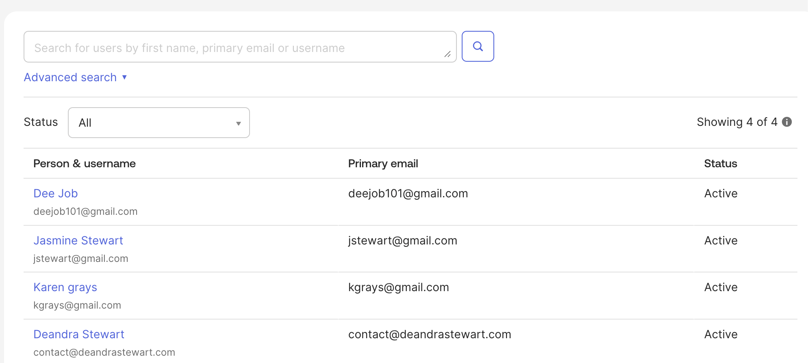
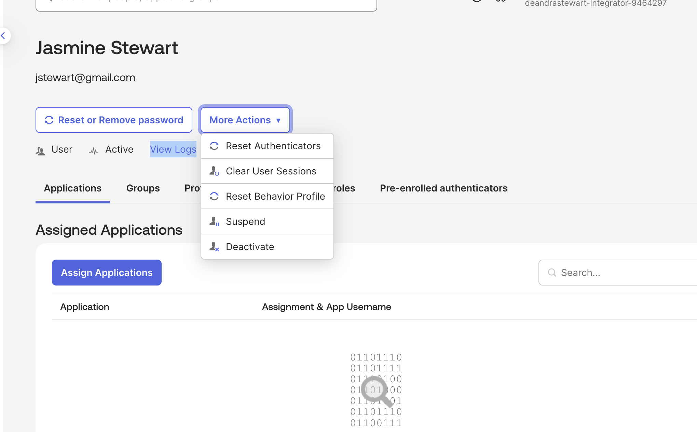
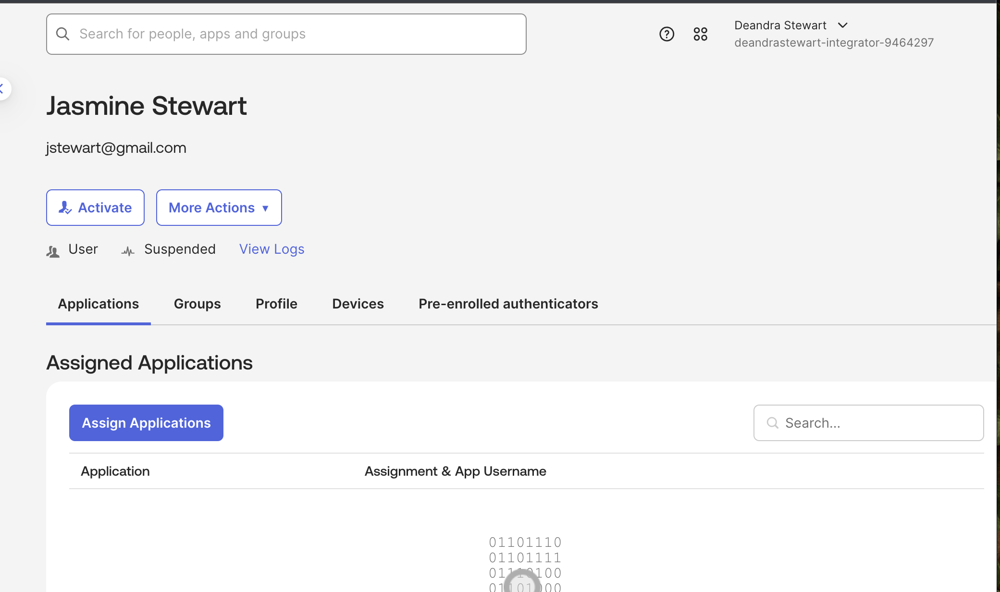
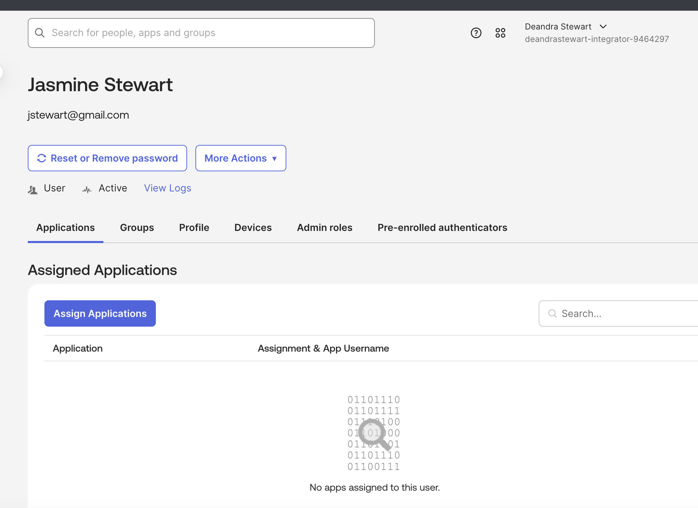

---

## Notes
- Suspended users cannot log in but retain all group and app memberships
- Unsuspending a user restores access immediately
- Use suspension for temporary situations — use deactivation for permanent removal

---------------------------------
# Lab 04 – Assign and Unassign Applications to Users in Okta OIE

## Objective
Practice assigning and removing application access for an individual user in Okta Identity Engine (OIE) via the Admin Console.

## Environment
- Okta Integrator Org (OIE)
- Admin Console → Directory → People

## Exam Relevance
- App assignment and access management
- Understanding direct user assignment vs group assignment
- App access removal during offboarding or role changes

---

## Key Concepts

- Apps can be assigned directly to individual users or to entire groups
- Assigned apps appear on the user's **My Apps** page
- The username used to sign into an app may differ from the user's Okta username
- If a user was assigned to an app via a **group**, you must either:
  - Remove the user from the group, OR
  - Unassign the app from the entire group
- You cannot directly unassign an app from a user if access came through group membership

---

## Steps

### Part 1 – Assign an Application

1. In the Admin Console, go to **Directory > People**
2. Search for the user by first name, email, or username
3. Click the username to open their profile
4. Select the **Applications** tab
5. Click **Assign Applications**
6. Search for or select an application from the list
7. Click **Assign**
8. Enter the app username and password if prompted
9. Click **Save and Go Back**

### Part 2 – Unassign an Application

1. In the Admin Console, go to **Directory > People**
2. Search for the same user
3. Click the username to open their profile
4. Select the **Applications** tab
5. Find the application to remove and click **X**
6. Click **OK** in the Unassign Application dialog to confirm

---

## Screenshots

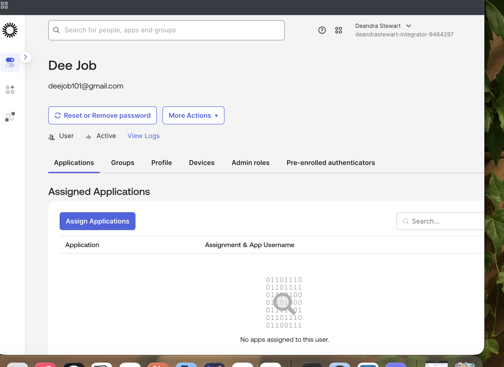
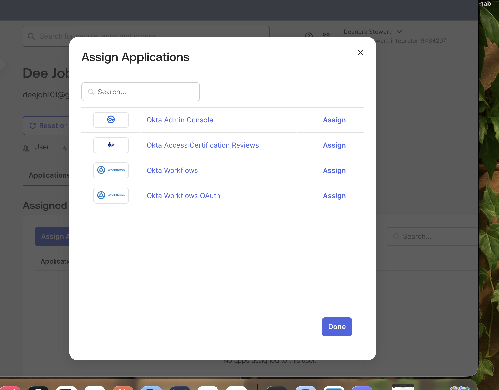
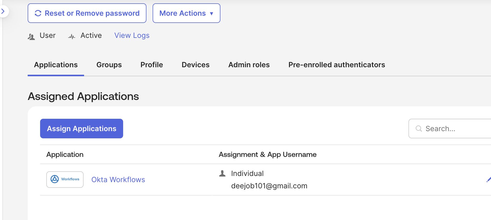
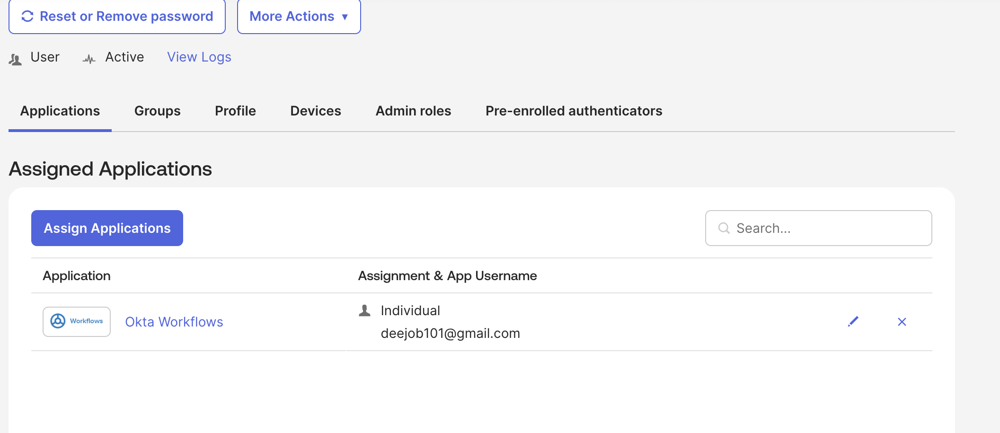
  

---

## Notes
- Direct user assignment is best for one-off access needs
- For broader access, assign the app to a group instead
- The app username entered during assignment is the credential used to authenticate to the app itself, not Okta
- Direct app unassignment takes effect immediately
- Use unassignment during offboarding to revoke specific app access without fully deactivating the account
- --------------------

# Lab 05 – Reset a User Password in Okta OIE

## Objective
Practice resetting a user password in Okta Identity Engine (OIE) via the Admin Console.

## Environment
- Okta Integrator Org (OIE)
- Admin Console → Directory → People

## Exam Relevance
- User credential management
- Understanding password reset options and their behavior

---

## Key Concepts

Two reset options are available:

| Option | What Happens |
|---|---|
| Send password reset email | Reset link sent to primary and secondary email — expires in 1 hour |
| Create a temporary password | Admin sets a temp password — user must change it on next login |

> Okta recommends securing all apps with MFA since admin-initiated resets bypass other factors.

---

## Steps

1. In the Admin Console, go to **Directory > People**
2. Find and select the user whose password you want to reset
3. Click **Reset or Remove password**
4. Choose a reset option:
   - **Send a password reset email** — sends a reset link to the user's primary and secondary email
   - **Create a temporary password** — sets a temp password and marks the account as expired
5. Optional: Select **Sign out user** to end all active sessions on devices and browsers
6. Click **Reset password**

---

## Screenshots
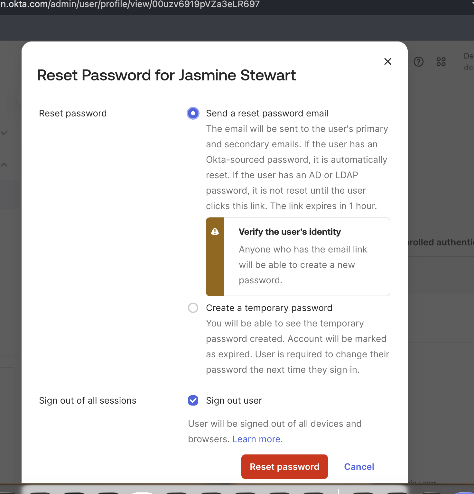

---

## Notes
- The email reset link expires after 1 hour
- Temporary passwords force a password change on next login
- For AD-sourced users — the original AD password does not expire when Okta resets it
- Admin-initiated resets do not require the user to provide other factors (MFA)
- Use "Sign out user" to immediately terminate all active sessions during a security incident

- ---------------

# Lab 06: Create a Custom Attribute

## Objective
Create a custom user attribute in the Okta Universal Directory to extend the default user profile schema.

## Environment
- Okta Integrator Free Plan org
- Admin Console

## Steps

1. Go to **Admin Console → Directory → Profile Editor**
2. Select the **User (default)** profile
3. Click **Add Attribute** and configure the following:

| Field | Value |
|-------|-------|
| Data type | String |
| Display name | Department |
| Variable name | department |
| Description | Employee department |
| Enum | Unchecked |
| Attribute required | Unchecked |
| User permission | Read Only |

4. Click **Save**

## Screenshots
- [Add Attribute Form](screenshots/add-attribute.png)

## Why This Matters
**IAM Relevance:** Custom attributes extend the identity schema to store metadata needed for policies, provisioning, and reporting.

**Okta Platform Use:** The Department attribute can be used in Group Rules and Conditional Access Policies.

**Business Value:** Enables consistent department-based access control across the organization.

