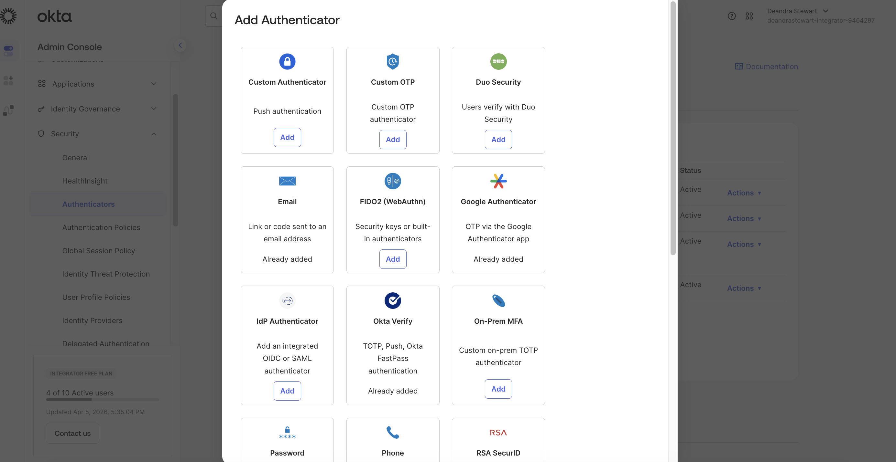
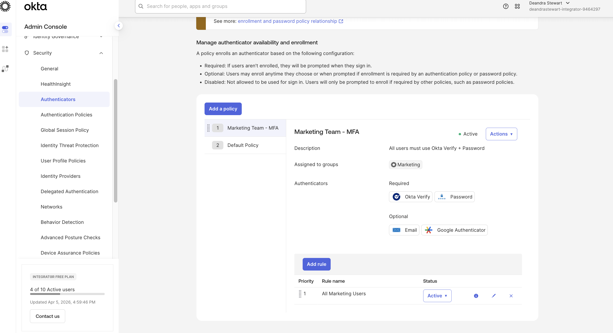
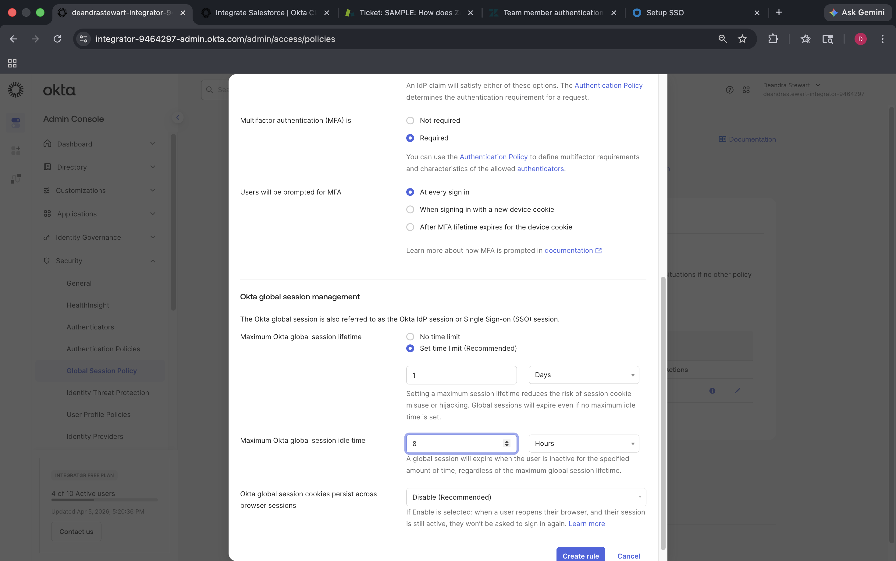
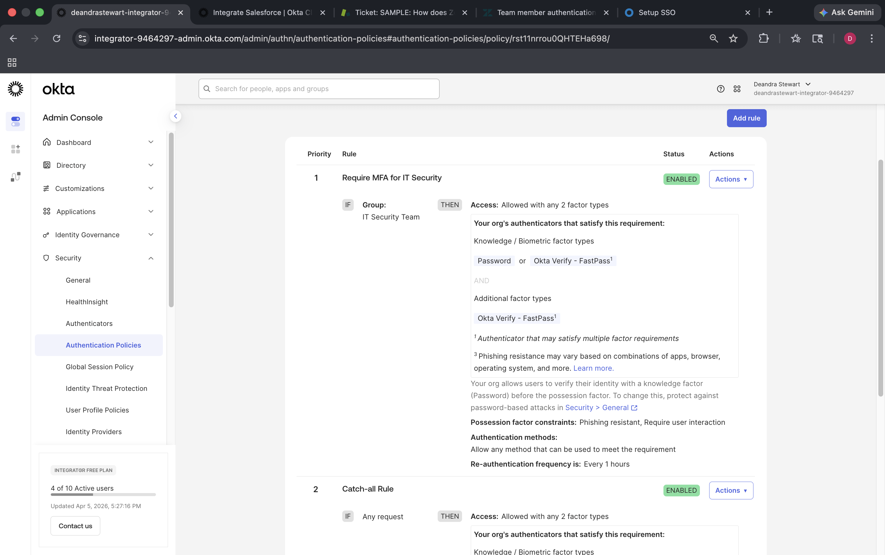

# Lab 01: Security Enforcement

## Objective
Configure authenticators, enrollment policies, global session policies, and authentication policies to enforce security controls across the Okta org.

## Environment
- Okta Integrator Free Plan org
- Admin Console

---

## Part 1: Add and Remove Authenticators

### Steps
1. Go to **Admin Console → Security → Authenticators**
2. Click **Add Authenticator**
3. Select **Google Authenticator**
4. Click **Add**

### Screenshot

---

## Part 2: Configure Enrollment Options

### Steps
1. Go to **Security → Authenticators → Enrollment tab**
2. Select **Marketing Team - MFA** policy
3. Click **Edit**
4. Set **Google Authenticator** to **Optional**
5. Click **Save**

### Screenshot

---

## Part 3: Create a Global Session Policy Rule

### Steps
1. Go to **Security → Global Session Policy**
2. Click **Add rule**
3. Configure the following:

| Field | Value |
|-------|-------|
| Rule name | Require MFA - All Users |
| MFA | Required |
| Session lifetime | 1 Day |
| Session idle time | 8 Hours |

4. Click **Save**

### Screenshot

---

## Part 4: Define an Authentication Policy and Rule

### Steps
1. Go to **Security → Authentication Policies**
2. Click **App sign-in → Add a policy**
3. Name the policy **IT Security Team Policy**
4. Click **Save**
5. Click **Add rule** and configure:

| Field | Value |
|-------|-------|
| Rule name | Require MFA for IT Security |
| IF Group | IT Security Team |
| THEN Access | Allowed after successful authentication |
| Authenticate with | Any 2 factor types |

6. Click **Save**

### Screenshot

---

## Why This Matters
**IAM Relevance:** Security policies enforce least privilege and MFA requirements to protect identity infrastructure.

**Okta Platform Use:** Global Session Policies control session lifetime org-wide while Authentication Policies apply granular MFA requirements per app or group.

**Business Value:** Reduces risk of unauthorized access, enforces compliance requirements, and protects high-value resources with layered authentication controls.
